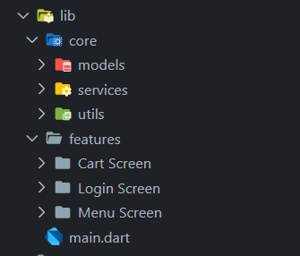

# 🍽️ RestaurantApp
### Modern Mobile Dining Experience for Food Lovers

*Bringing restaurant dining to your fingertips with seamless ordering and menu browsing*

**🚀 Built with Flutter & Firebase**

---

## 📋 Project Overview

RestaurantApp is a modern mobile application designed to enhance the dining experience by providing users with easy access to restaurant menus, secure authentication, and intuitive cart management. Built with Flutter and powered by Firebase, this app transforms traditional restaurant ordering into a seamless digital experience.

## ✨ Key Features

### 🔐 **Secure Authentication**
- **Firebase Authentication** - Robust email and password login system
- **Form Validation** - Comprehensive input validation for secure user experience

### 🍕 **Dynamic Menu System**
- **Real-time Menu Display** - Live menu items fetched from Firebase Firestore
- **Rich Item Details** - Complete food information including name, price, and images

### 🛒 **Smart Cart Management**
- **Add/Remove Items** - Intuitive cart functionality with quantity controls
- **Real-time Price Calculation** - Automatic total price updates
- **Local State Management** - Efficient cart state using Flutter's setState

### 📱 **User Experience**
- **Clean Navigation** - Smooth transitions between screens
- **Responsive Design** - Optimized for various screen sizes
- **User-friendly Interface** - Modern UI design for enhanced usability

## 🛠️ Technical Stack

| Component | Technology |
|-----------|------------|
| **Frontend** | Flutter & Dart |
| **Backend** | Firebase (Auth & Firestore) |
| **Authentication** | Firebase Authentication |
| **Database** | Firebase Firestore |
| **State Management** | setState (Local State) |
| **Architecture** | Clean Architecture Pattern |
| **Version Control** | Git & GitHub |

## 🏗️ Architecture

The app follows **Clean Architecture** principles with organized folder structure, ensuring:
- **Separation of Concerns** - Distinct layers for screens, services, and widgets
- **Maintainable Code** - Well-structured codebase for easy maintenance
- **Scalability** - Modular design for future feature additions
- **Firebase Integration** - Seamless backend connectivity

> 

## 🚀 Upcoming Features

- **User Profiles** - Personal account management and preferences
- **Order History** - Track previous orders and reorder favorites
- **Push Notifications** - Real-time order updates and promotions
- **Payment Integration** - Secure payment processing
- **Restaurant Locator** - Find nearby restaurant locations
- **Reviews & Ratings** - User feedback and rating system

## 📱 UI Screenshots

  <table>
    <tr>
      <td align="center">
        
         
        <b>Secure Login</b>
      </td>
      <td align="center">
        
         
        <b>Dynamic Menu</b>
      </td>
      <td align="center">
        
         
        <b>Smart Cart</b>
      </td>
      <td align="center">
        
         
        <b>Smart Cart</b>
      </td>
    </tr>
  </table>

## 🤝 Contributing

Contributions are welcome! Please feel free to submit a Pull Request. For major changes, please open an issue first to discuss what you would like to change.

---

**🍽️ Bringing restaurants closer to you, one tap at a time 🚀**

⭐ **Star this repository if you love great food and clean code!** ⭐

**📱 Built with ❤️ using Flutter & Firebase**

